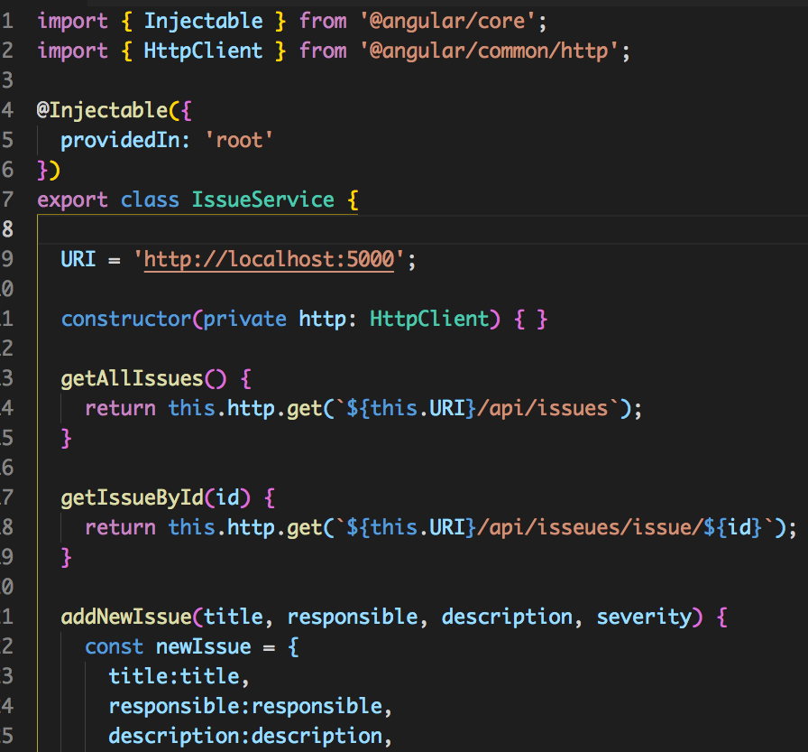

The purpose of this app is to create a application that allows users to submit issues, their severity, description, person responsible, and the status. This was built using the MEAN Stack.

# Services Class
  This class is used to communicate with the backend api for the app.
  Here is where all the HTTP Requestes are made.
  
  
