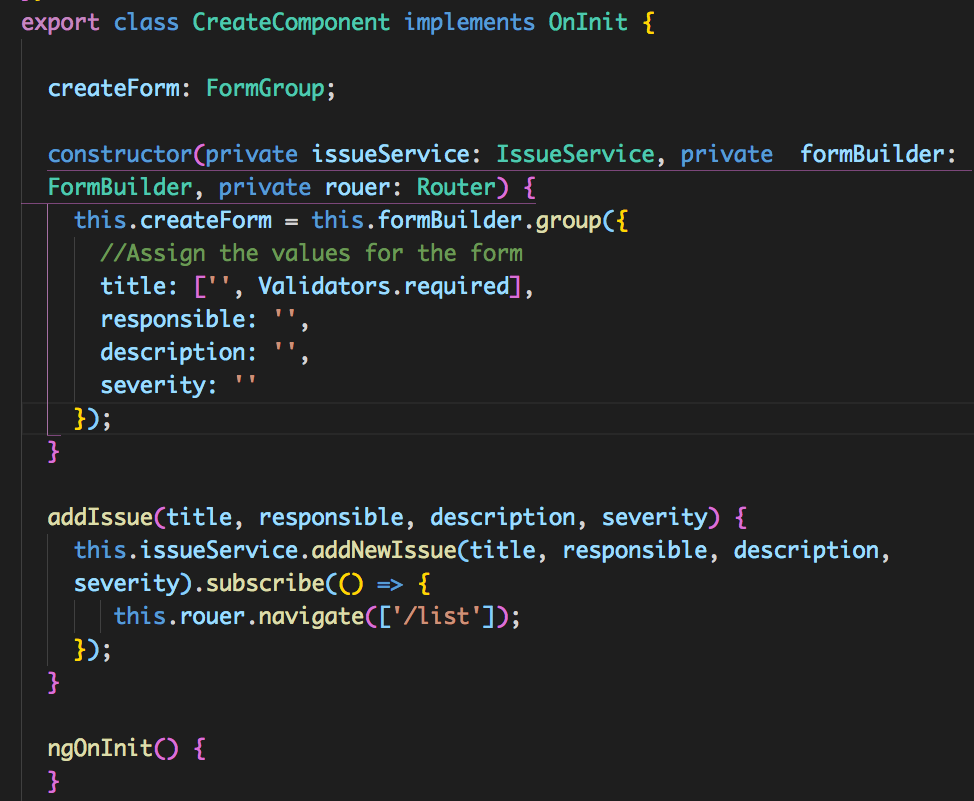

The purpose of this app is to create a application that allows users to submit issues, their severity, description, person responsible, and the status. This was built using the MEAN Stack.

# Services Class
  This class is used to communicate with the backend api for the app.
  Here is where all the HTTP Requestes are made.
  
  
# Routes
This app is a single page application, so I used Angulars router module to create the respected routes.

# Create Class
This file was responsible for creating a new issue. Here I imported the needed imports from Angular Material, I imported the IssueServiceInterface to set the new issues array to that interface. Here I also connected with the IssueService its self to grab the needed method of createIssue().

